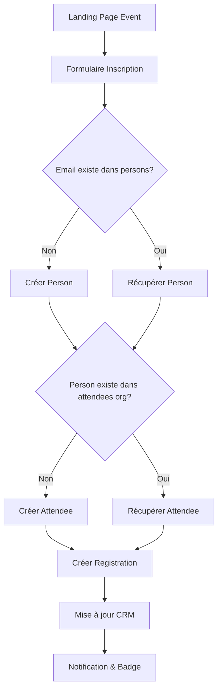

# Architecture Attendees vs Registrations

## 🎯 Vue d'Ensemble

Cette architecture sépare les **profils globaux** (Attendees) des **inscriptions spécifiques** (Registrations) pour créer un véritable CRM événementiel.

## 📊 Modèle de Données

### 1. **Persons** (Table Globale Cross-Org)

```sql
persons (
  id uuid pk,
  first_name text,
  last_name text,
  email text unique,
  phone text,
  company text,
  job_title text,
  country text,
  metadata jsonb
)
```

**Rôle** : Profil universel d'une personne physique, partagé entre organisations.

### 2. **Attendees** (CRM par Organisation)

```sql
attendees (
  id uuid pk,
  org_id uuid not null → organizations(id),
  person_id uuid not null → persons(id),
  default_type_id uuid → attendee_types(id),
  labels text[],
  notes text
)
```

**Rôle** : Profil CRM d'une personne dans une organisation spécifique.
**Unique** : (org_id, person_id) - Une personne = un attendee par org.

### 3. **Registrations** (Inscriptions Événements)

```sql
registrations (
  id uuid pk,
  org_id uuid not null,
  event_id uuid not null → events(id),
  attendee_id uuid not null → attendees(id),
  status text not null, -- 'awaiting'|'approved'|'refused'|'cancelled'
  attendance_type text, -- 'online'|'onsite'|'hybrid'
  answers jsonb,
  event_attendee_type_id uuid → event_attendee_types(id)
)
```

**Rôle** : Inscription spécifique d'un attendee à un événement.
**Unique** : (event_id, attendee_id) - Un attendee peut s'inscrire une seule fois par événement.

## 🔄 Flux de Données

### Inscription via Landing Page



### API Flow

```typescript
// 1. Vérification/Création Person
const person = (await findPersonByEmail(email)) || (await createPerson(data))

// 2. Vérification/Création Attendee
const attendee =
  (await findAttendee(orgId, person.id)) ||
  (await createAttendee(orgId, person.id, defaultType))

// 3. Création Registration
const registration = await createRegistration({
  eventId,
  attendeeId: attendee.id,
  status: 'awaiting',
  attendanceType: 'onsite',
  answers: formData,
})

// 4. Mise à jour CRM automatique
await updateAttendeeHistory(attendee.id)
```

## 📈 Avantages Business

### 1. **CRM Intégré**

- Profil unique par personne avec historique complet
- Segmentation avancée basée sur comportement
- Marketing ciblé selon les événements fréquentés

### 2. **Analytics Cross-Événements**

```sql
-- Participants récurrents
SELECT a.*, COUNT(r.id) as events_count
FROM attendees a
JOIN registrations r ON a.id = r.attendee_id
GROUP BY a.id
HAVING COUNT(r.id) > 3

-- Taux de conversion par type d'événement
SELECT et.name,
       COUNT(r.id) as inscriptions,
       COUNT(CASE WHEN r.status = 'approved' THEN 1 END) as approuves
FROM events e
JOIN registrations r ON e.id = r.event_id
JOIN org_event_types et ON e.org_event_type_id = et.id
GROUP BY et.name
```

### 3. **Prévention Doublons**

- Un email = une personne dans le système
- Enrichissement automatique des profils
- Cohérence des données garantie

## 🛠 Implémentation Frontend

### Types TypeScript

```typescript
// Domain Objects (DPO)
interface PersonDPO {
  id: string
  firstName?: string
  lastName?: string
  email?: string
  phone?: string
  company?: string
  jobTitle?: string
  country?: string
}

interface AttendeeDPO {
  id: string
  orgId: string
  person: PersonDPO
  defaultType?: AttendeeTypeDPO
  labels: string[]
  notes?: string
  eventsHistory: EventDPO[] // Calculé côté API
  totalEvents: number // Calculé côté API
}

interface RegistrationDPO {
  id: string
  event: EventDPO
  attendee: AttendeeDPO
  status: 'awaiting' | 'approved' | 'refused' | 'cancelled'
  attendanceType?: 'online' | 'onsite' | 'hybrid'
  answers?: Record<string, any>
  eventAttendeeType?: EventAttendeeTypeDPO
  registeredAt: string
}
```

### RTK Query Endpoints

```typescript
// features/attendees/api/attendeesApi.ts
export const attendeesApi = createApi({
  reducerPath: 'attendeesApi',
  tagTypes: ['Attendee', 'Attendees', 'Registration', 'Registrations'],
  endpoints: (builder) => ({
    // CRM Global
    getAttendees: builder.query<AttendeeDPO[], AttendeeFilters>({
      query: (params) => ({ url: '/attendees', params }),
      providesTags: ['Attendees'],
    }),

    getAttendeeById: builder.query<AttendeeDPO, string>({
      query: (id) => `/attendees/${id}`,
      providesTags: (result, error, id) => [{ type: 'Attendee', id }],
    }),

    // Registrations par événement
    getEventRegistrations: builder.query<RegistrationDPO[], string>({
      query: (eventId) => `/events/${eventId}/registrations`,
      providesTags: ['Registrations'],
    }),

    // Inscription (logique complexe côté API)
    registerToEvent: builder.mutation<RegistrationDPO, RegisterEventData>({
      query: ({ eventId, ...data }) => ({
        url: `/events/${eventId}/register`,
        method: 'POST',
        body: data,
      }),
      invalidatesTags: ['Attendees', 'Registrations'],
    }),

    updateRegistrationStatus: builder.mutation<
      RegistrationDPO,
      UpdateRegistrationStatusData
    >({
      query: ({ id, ...data }) => ({
        url: `/registrations/${id}/status`,
        method: 'PUT',
        body: data,
      }),
      invalidatesTags: ['Registrations'],
    }),
  }),
})
```

## 🎨 Interface Utilisateur

### 1. **Page CRM Attendees**

- Liste paginée avec filtres avancés
- Colonnes : Nom, Email, Société, Dernière participation, Total événements
- Actions : Voir profil, Éditer, Exporter

### 2. **Profil Attendee**

- Informations personnelles
- Historique des événements avec statuts
- Notes et labels CRM
- Actions rapides : Inscrire à un événement, Envoyer invitation

### 3. **Registrations Event**

- Liste des inscriptions pour un événement
- Filtres par statut, type, date d'inscription
- Actions : Approuver, Refuser, Check-in, Générer badge

### 4. **Formulaire d'Inscription**

- Détection automatique si personne existante
- Pré-remplissage des champs connus
- Validation et enrichissement du profil

## 🔮 Évolutions Futures

### Phase 1 (Current)

- ✅ Events CRUD avec toasts
- 🎯 **Attendees CRM** (next)
- 🎯 **Registrations Management** (next)

### Phase 2

- Formulaires d'inscription publics
- Workflows d'approbation
- Système de badges et QR codes

### Phase 3

- Check-in mobile
- Analytics avancées
- Campagnes marketing automatisées
- Intégrations externes (Mailchimp, etc.)

Cette architecture garantit une évolutivité maximale et une expérience utilisateur cohérente à travers tous les événements de l'organisation. 🚀
