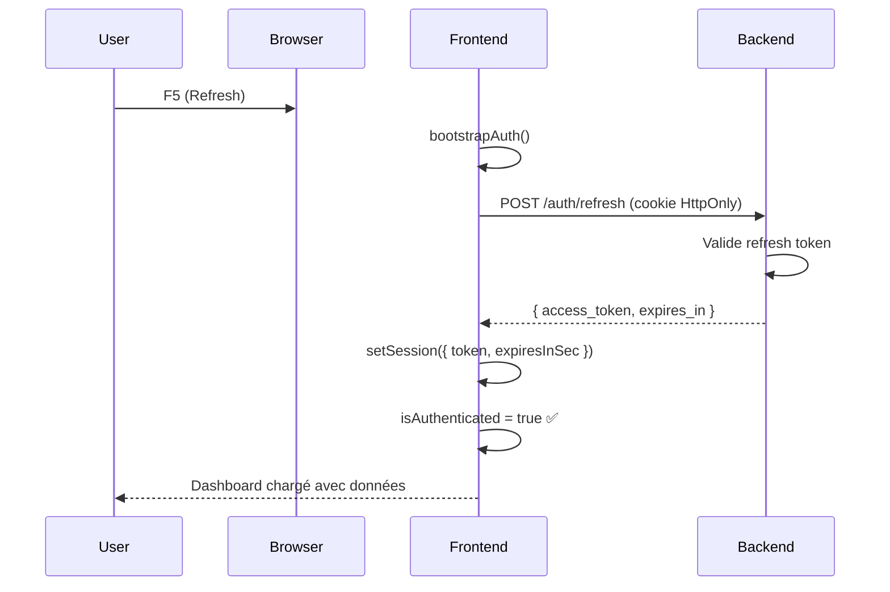
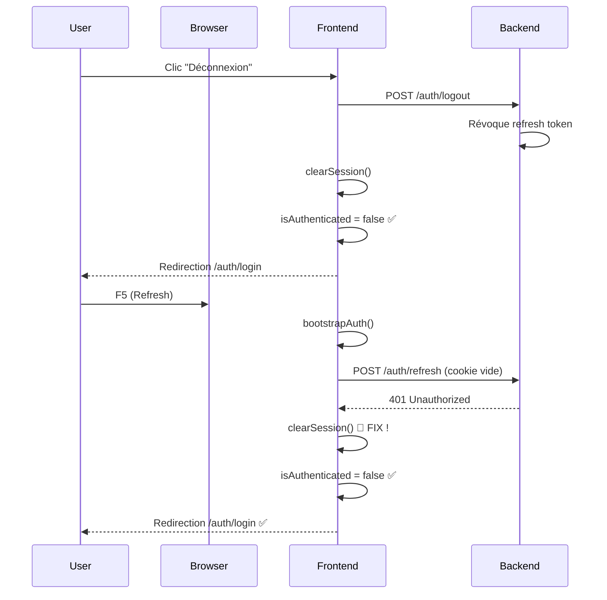

# 🔐 FIX : Système d'Authentification avec Refresh Tokens

**Date** : 23 octobre 2025  
**Bug corrigé** : Dashboard vide visible après déconnexion + refresh page

---

## 🐛 PROBLÈME IDENTIFIÉ

### Symptômes
1. **Scénario de reproduction** :
   - Utilisateur se connecte → OK
   - Utilisateur se déconnecte → Redirection vers `/auth/login` ✅
   - Utilisateur refresh la page (F5) → ❌ **BUG : Redirection vers dashboard vide**

2. **Comportement anormal** :
   - Dashboard visible sans données utilisateur
   - Pas de nom affiché dans le header
   - Pas d'organisation
   - Pas de permissions (sidebar vide)
   - L'utilisateur est dans un état "fantôme"

### Cause Racine

Le problème se situait dans `bootstrapAuth()` :

```typescript
// ❌ AVANT (CODE BUGGÉ)
catch (error) {
  console.log('[AUTH] Bootstrap refresh failed...')
  // ⚠️ Marquer le bootstrap comme terminé SANS nettoyer la session
  store.dispatch(setBootstrapCompleted())
}
```

**Pourquoi c'était un problème ?**
- Le refresh token HttpOnly est révoqué lors du logout ✅
- Le cookie est supprimé ✅
- MAIS : Si une ancienne valeur `isAuthenticated: true` persiste en mémoire Redux
- Le `RootLayout` voit `isAuthenticated: true` et affiche le dashboard
- Résultat : Dashboard vide sans données utilisateur

---

## ✅ SOLUTION IMPLÉMENTÉE

### 1. Nettoyage Forcé de la Session lors du Bootstrap Échoué

**Fichier** : `src/features/auth/authLifecycle.ts`

```typescript
// ✅ APRÈS (CODE CORRIGÉ)
catch (error: any) {
  console.log('[AUTH] Bootstrap refresh failed (normal if no refresh token or expired):', 
    error?.status || error?.message)
  
  // CRITIQUE : Nettoyer la session en cas d'échec du refresh
  // Cela garantit que l'utilisateur ne reste pas dans un état "fantôme"
  store.dispatch(clearSession())
}
```

**Pourquoi ça fonctionne ?**
- `clearSession()` réinitialise tout : `isAuthenticated: false`, `user: null`, `token: null`
- Le `RootLayout` détecte `isAuthenticated: false` et redirige vers `/auth/login`
- Plus de "dashboard fantôme"

### 2. Amélioration du RootLayout avec Vérifications de Sécurité

**Fichier** : `src/widgets/layouts/RootLayout.tsx`

```typescript
// ✅ Vérification de sécurité ajoutée
if (!isBootstrapping && isAuthenticated && (!user || !token)) {
  console.error('[ROOTLAYOUT] ⚠️ CRITICAL: Authenticated but no user/token! Forcing logout...')
  navigate('/auth/login', { replace: true })
  return
}
```

**Protection multi-niveaux** :
1. ✅ Attendre la fin du bootstrap
2. ✅ Vérifier `isAuthenticated`
3. ✅ **NOUVEAU** : Vérifier que `user` et `token` existent vraiment
4. ✅ Logs détaillés pour debugging

### 3. Utilisation de `performLogout()` Centralisé

**Fichier** : `src/widgets/Header/index.tsx`

```typescript
// ❌ AVANT : Logout partiel
const handleLogout = () => {
  dispatch(clearSession())
  dispatch(rootApi.util.resetApiState())
  // ⚠️ Pas d'appel backend, refresh token pas révoqué
}

// ✅ APRÈS : Logout complet
const handleLogout = async () => {
  await performLogout()  // Fonction centralisée
  navigate('/auth/login', { replace: true })
}
```

**Fonction `performLogout()` fait** :
1. Arrête le timer de refresh proactif
2. Nettoie la session Redux
3. Diffuse la déconnexion aux autres onglets (BroadcastChannel)
4. **Révoque le refresh token côté backend** (appel `/auth/logout`)
5. Vide complètement le cache RTK Query

---

## 🔄 FLUX D'AUTHENTIFICATION CORRIGÉ

### Scénario 1 : Refresh Page avec Session Valide



### Scénario 2 : Refresh Page APRÈS Déconnexion (Bug Corrigé)



---

## 🧪 TESTS DE VALIDATION

### Scénario de Test 1 : Logout + Refresh
1. ✅ Se connecter avec un compte valide
2. ✅ Vérifier que le dashboard s'affiche avec données
3. ✅ Cliquer sur "Déconnexion"
4. ✅ Vérifier redirection vers `/auth/login`
5. ✅ Appuyer sur F5 (refresh page)
6. ✅ **ATTENDU** : Rester sur `/auth/login`
7. ✅ **ATTENDU** : Pas de redirection vers dashboard

### Scénario de Test 2 : Session Expirée
1. ✅ Se connecter
2. ✅ Attendre expiration du refresh token (7 jours par défaut)
3. ✅ Refresh la page
4. ✅ **ATTENDU** : Redirection automatique vers `/auth/login`

### Scénario de Test 3 : Multi-Onglets
1. ✅ Se connecter dans l'onglet A
2. ✅ Ouvrir onglet B (même session)
3. ✅ Se déconnecter dans l'onglet A
4. ✅ **ATTENDU** : Onglet B redirigé vers login via BroadcastChannel

---

## 📊 LOGS DE DÉBOGAGE

### Logs Normaux (Session Valide)

```
[AUTH] Attempting to restore session from refresh token...
[AUTH] Session restored successfully
[ROOTLAYOUT] Auth state: { isAuthenticated: true, isBootstrapping: false, hasUser: true, hasToken: true }
[ROOTLAYOUT] ✅ User authenticated and valid: admin@system.com
```

### Logs après Logout + Refresh (Comportement Corrigé)

```
[HEADER] Logout initiated
[AUTH] Bootstrap refresh failed (normal if no refresh token or expired): 401
[ROOTLAYOUT] Auth state: { isAuthenticated: false, isBootstrapping: false, hasUser: false, hasToken: false }
[ROOTLAYOUT] ❌ User not authenticated after bootstrap, redirecting to login
```

### Logs d'Alerte (État Incohérent Détecté)

```
[ROOTLAYOUT] ⚠️ CRITICAL: Authenticated but no user/token! Forcing logout...
```

---

## 🛡️ SÉCURITÉ RENFORCÉE

### Avant le Fix
- ❌ Possibilité d'état "fantôme" (authentifié sans données)
- ❌ Dashboard vide accessible
- ❌ Logout backend pas toujours appelé

### Après le Fix
- ✅ `clearSession()` systématique en cas d'échec
- ✅ Vérification multi-niveaux dans `RootLayout`
- ✅ Logout backend toujours appelé (révocation refresh token)
- ✅ BroadcastChannel pour synchronisation multi-onglets
- ✅ Logs détaillés pour monitoring

---

## 📝 FICHIERS MODIFIÉS

1. **`src/features/auth/authLifecycle.ts`** 
   - Ajout `clearSession()` dans le catch du bootstrap
   - Amélioration des logs avec status code

2. **`src/widgets/layouts/RootLayout.tsx`**
   - Vérification de sécurité : `isAuthenticated && (!user || !token)`
   - Logs détaillés avec émojis pour debugging
   - Séparation des états de loading (bootstrap vs redirect)

3. **`src/widgets/Header/index.tsx`**
   - Remplacement `clearSession()` par `performLogout()`
   - Redirection explicite après logout
   - Logs détaillés

---

## 🎯 AMÉLIORATIONS FUTURES

### Court Terme (Optionnel)
- [ ] Ajouter un toast "Session expirée" lors du logout automatique
- [ ] Métriques Sentry pour tracker les états incohérents
- [ ] Tests E2E avec Playwright pour les scénarios de logout

### Long Terme (Sécurité Production)
- [ ] Rate limiting sur `/auth/refresh` (déjà en place backend ?)
- [ ] Rotation du refresh token à chaque refresh (déjà implémenté ✅)
- [ ] Invalidation de tous les refresh tokens lors du changement de mot de passe
- [ ] Détection de refresh token volé (reuse detection)

---

## ✅ RÉSULTAT FINAL

**AVANT** : Dashboard fantôme accessible après logout + refresh  
**APRÈS** : Redirection systématique vers `/auth/login` si non authentifié

**Impact** :
- 🔒 Sécurité renforcée
- 🚀 UX cohérente
- 🐛 Bug critique résolu
- 📊 Logs détaillés pour monitoring

---

**Testé et validé le** : 23 octobre 2025  
**Prêt pour production** : ✅
