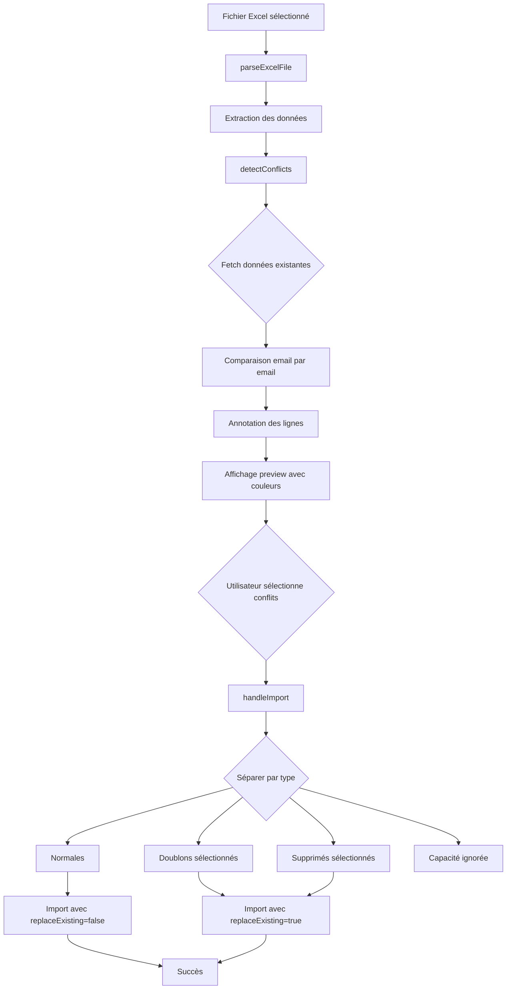

# Amélioration de l'Import Excel - Documentation

## 📋 Vue d'ensemble

Cette amélioration transforme le système d'import Excel des inscriptions en remplaçant le wizard multi-étapes par une interface single-page avec détection et résolution de conflits en temps réel.

## 🎯 Objectif

Permettre aux utilisateurs de voir immédiatement les conflits potentiels (doublons, capacité dépassée, inscriptions supprimées) directement dans la prévisualisation des données, sans avoir à passer par une étape séparée.

## ✨ Fonctionnalités principales

### 1. Détection immédiate des conflits

Dès que le fichier Excel est analysé, le système :
- Récupère les inscriptions existantes de l'événement
- Compare chaque ligne du fichier avec les inscriptions existantes
- Identifie les conflits et annote chaque ligne

### 2. Types de conflits

| Type | Couleur | Description | Action possible |
|------|---------|-------------|-----------------|
| **Normal** | Blanc | Nouvelle inscription sans conflit | Import direct |
| **Doublon** | Orange | Email déjà inscrit (actif) | Sélectionnable pour remplacement |
| **Supprimé** | Orange | Email dans la corbeille (soft-deleted) | Sélectionnable pour restauration |
| **Capacité** | Rouge | Capacité de l'événement dépassée | Non importable |

### 3. Résolution interactive

- Les lignes en conflit (doublons, supprimés) affichent une checkbox permettant de les sélectionner
- L'utilisateur peut choisir quelles inscriptions remplacer/restaurer
- Les lignes de capacité dépassée sont visuellement distinctes mais non importables
- Boutons "Sélectionner tous les conflits" / "Désélectionner tous"

### 4. Import intelligent

L'import sépare les lignes en 4 catégories :
1. **Normales** : importées directement
2. **Doublons sélectionnés** : remplacent les inscriptions existantes (avec `replaceExisting=true`)
3. **Supprimées sélectionnées** : restaurent et mettent à jour les inscriptions (avec `replaceExisting=true`)
4. **Capacité dépassée** : ignorées automatiquement

## 🔧 Modifications techniques

### Fichier modifié
`attendee-ems-front/src/features/registrations/ui/ImportExcelModal.tsx`

### Nouveaux imports
```typescript
import { AlertTriangle, XCircle, Info } from 'lucide-react'
import { useGetRegistrationsQuery } from '../api/registrationsApi'
import { useGetEventQuery } from '@/features/events/api/eventsApi'
```

### Interface étendue
```typescript
interface ParsedRow {
  [key: string]: any
  _rowIndex?: number              // Index de la ligne
  _conflictType?: 'duplicate' | 'capacity' | 'deleted' | null
  _existingData?: any             // Données existantes
  _selected?: boolean             // Sélectionné pour remplacement
}
```

### Nouvelles fonctions

#### `detectConflicts(data: ParsedRow[]): ParsedRow[]`
- Détecte les conflits en comparant avec les inscriptions existantes
- Annote chaque ligne avec `_conflictType`, `_existingData`, `_selected`
- Vérifie la capacité restante de l'événement

#### `handleImport()`
- Rewritten pour gérer les 4 types de lignes
- Filtre les lignes selon leur type et leur sélection
- Nettoie les métadonnées avant l'envoi
- Envoie au backend avec `replaceExisting=true` pour les remplacements

#### `toggleRowSelection(rowIndex: number)`
- Permet de cocher/décocher une ligne en conflit

#### `selectAllConflicts()` / `deselectAllConflicts()`
- Gestion en masse des sélections

### Étapes du wizard simplifiées

**Avant** : `upload` → `preview` → `conflicts` → `success`

**Après** : `upload` → `preview` (avec conflits inline) → `success`

### UI mise à jour

#### Légende des conflits
```tsx
<div className="bg-blue-50 ...">
  <Info className="..." />
  <div>
    <h4>Conflits détectés</h4>
    <div className="grid grid-cols-4 gap-3">
      <div>🔲 Normal</div>
      <div>🟧 Doublon(s)</div>
      <div>🟧 Supprimé(s)</div>
      <div>🟥 Capacité</div>
    </div>
  </div>
</div>
```

#### Lignes colorées
- Fond blanc : normal
- Fond orange (`bg-orange-50 dark:bg-orange-900/20`) : doublon ou supprimé
- Fond rouge (`bg-red-50 dark:bg-red-900/20`) : capacité dépassée

#### Checkbox par ligne
- Visible uniquement pour les doublons et supprimés
- Icône d'avertissement pour les lignes de capacité

## 🔄 Flux de données



## 🎨 Expérience utilisateur

### Avant
1. Upload du fichier ✅
2. Prévisualisation des données ✅
3. Import initial → Erreurs de conflits ❌
4. Page séparée pour résoudre les conflits ❌
5. Deuxième import pour appliquer ❌

### Après
1. Upload du fichier ✅
2. **Prévisualisation avec conflits visibles** ✅
3. **Sélection inline des remplacements** ✅
4. **Import unique** ✅
5. Succès ✅

## ⚠️ Points d'attention

### Performance
- Les queries `useGetRegistrationsQuery` et `useGetEventQuery` sont appelées dès l'ouverture du modal
- La détection de conflits est effectuée côté client (pas de latence réseau)
- Pour les événements avec beaucoup d'inscriptions (>1000), considérer une pagination ou recherche côté serveur

### Compatibilité backend
- Le backend doit supporter le paramètre `replaceExisting=true` (déjà implémenté)
- L'endpoint `/events/:eventId/registrations/bulk-import` gère déjà les upserts
- Aucune modification backend requise ✅

### Edge cases
- Si l'utilisateur modifie un email dans la preview, les conflits sont recalculés automatiquement
- Si l'utilisateur supprime une ligne, les conflits sont recalculés
- Les inscriptions avec statut `declined` ne sont pas considérées comme des conflits

## 📊 Tests recommandés

### Scénarios à tester

1. **Import simple** : Fichier sans conflits
   - ✅ Toutes les lignes en blanc
   - ✅ Import direct

2. **Doublons** : Email déjà inscrit
   - ✅ Ligne en orange
   - ✅ Checkbox visible
   - ✅ Remplacement fonctionnel

3. **Restauration** : Email soft-deleted
   - ✅ Ligne en orange avec mention "Supprimé"
   - ✅ Restauration + mise à jour

4. **Capacité** : Plus de places disponibles
   - ✅ Lignes en rouge
   - ✅ Pas de checkbox
   - ✅ Non importées

5. **Mixte** : Combinaison de tous les types
   - ✅ Couleurs correctes
   - ✅ Compteurs exacts
   - ✅ Sélection partielle

6. **Édition inline** : Modifier un email dans la preview
   - ✅ Recalcul des conflits
   - ✅ Mise à jour des couleurs

## 🚀 Déploiement

### Prérequis
- Backend version compatible (déjà déployé)
- Redux Toolkit Query configuré (déjà en place)

### Installation
```bash
# Déjà fait - les modifications sont dans le fichier existant
# Aucune nouvelle dépendance requise
```

### Vérification
1. Ouvrir la page d'un événement
2. Cliquer sur "Importer des inscriptions"
3. Uploader un fichier Excel avec des doublons
4. Vérifier les couleurs et checkboxes
5. Tester l'import avec sélection partielle

## 📝 Notes techniques

### État du composant
```typescript
const [preview, setPreview] = useState<ParsedRow[]>([])
const [allData, setAllData] = useState<ParsedRow[]>([])
const [headers, setHeaders] = useState<string[]>([])
const [columnMapping, setColumnMapping] = useState<Record<string, string>>({})
const [step, setStep] = useState<'upload' | 'preview' | 'success'>('upload')
const [importResult, setImportResult] = useState<any>(null)
const [isProcessing, setIsProcessing] = useState(false)
```

### Queries RTK
```typescript
const { data: eventData } = useGetEventQuery(eventId, { skip: !isOpen })
const { data: existingRegistrationsData } = useGetRegistrationsQuery(
  { eventId, includeDeleted: true },
  { skip: !isOpen }
)
```

### Nettoyage des métadonnées
Avant l'envoi au backend, les propriétés internes sont supprimées :
```typescript
const cleanRow = { ...row }
delete cleanRow._rowIndex
delete cleanRow._conflictType
delete cleanRow._existingData
delete cleanRow._selected
```

## 🎉 Avantages

1. **UX améliorée** : Tout visible en un coup d'œil
2. **Moins de clics** : 1 import au lieu de 2
3. **Transparence** : L'utilisateur sait exactement ce qui sera importé
4. **Flexibilité** : Sélection granulaire des remplacements
5. **Performance** : Détection côté client sans appels API supplémentaires

## 🔗 Références

- [Fichier modifié](../src/features/registrations/ui/ImportExcelModal.tsx)
- [API Backend](../../attendee-ems-back/docs/PHASE1_API.md)
- [Documentation RBAC](../../attendee-ems-back/docs/RBAC_GUIDE.md)
